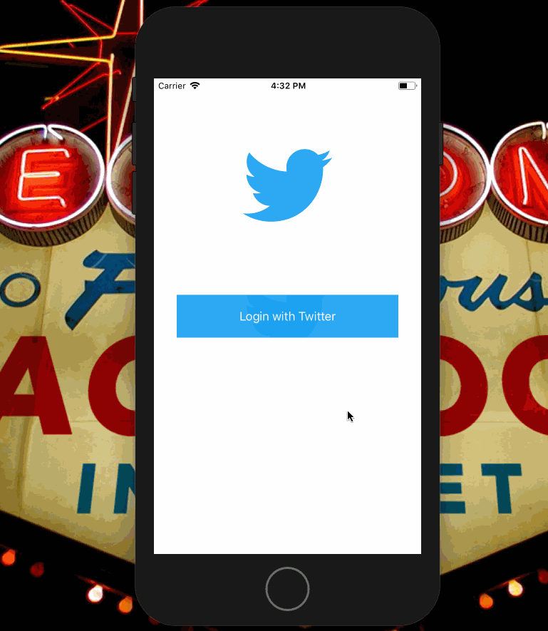
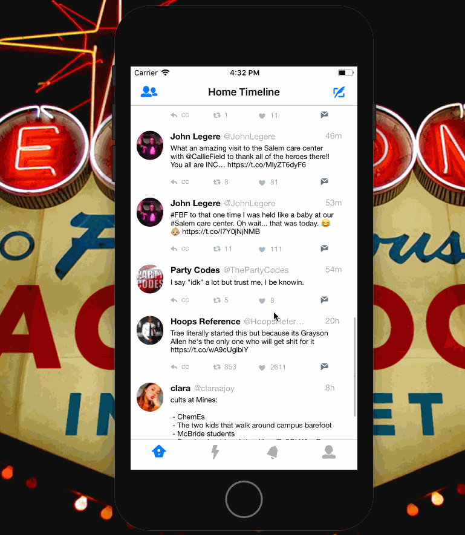
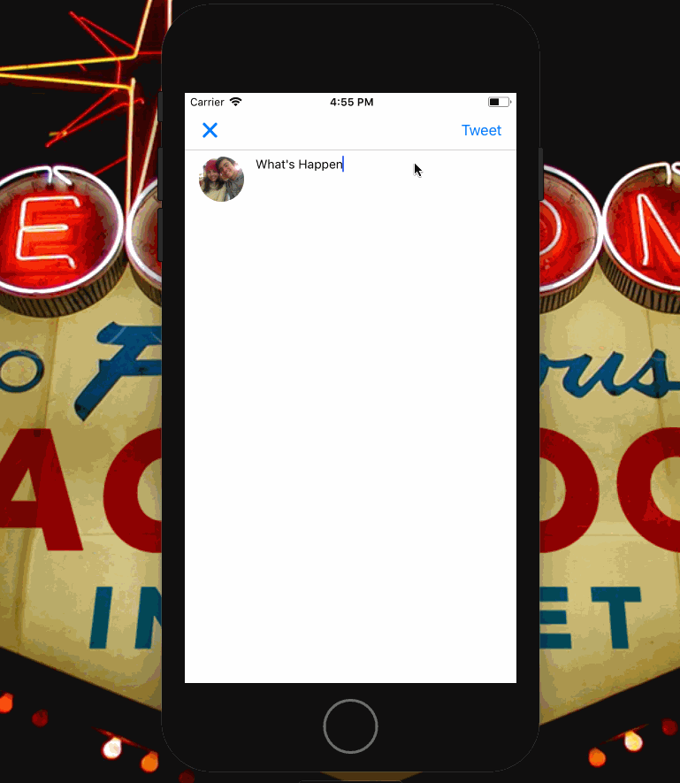
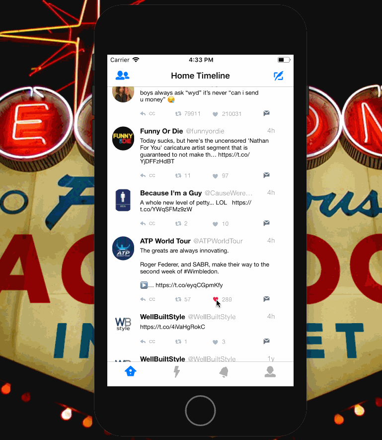
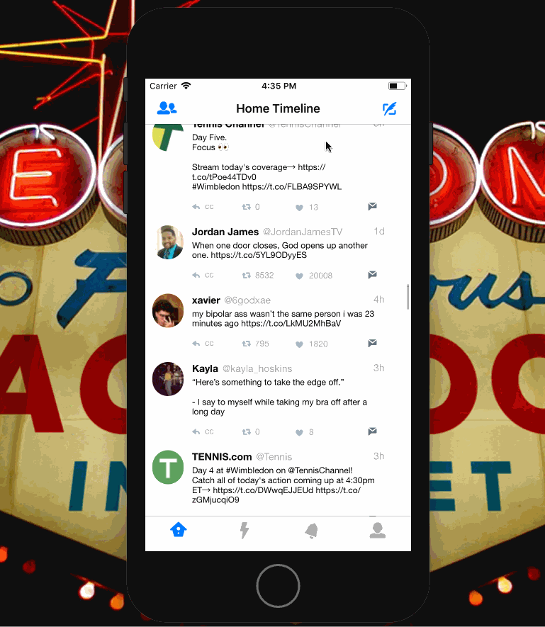
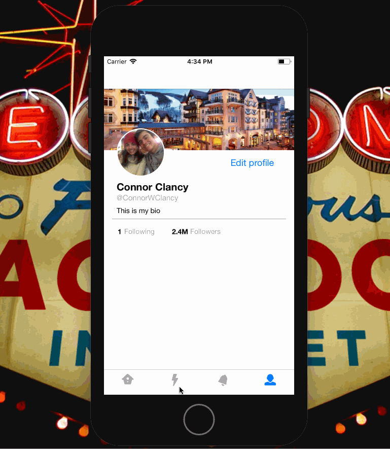
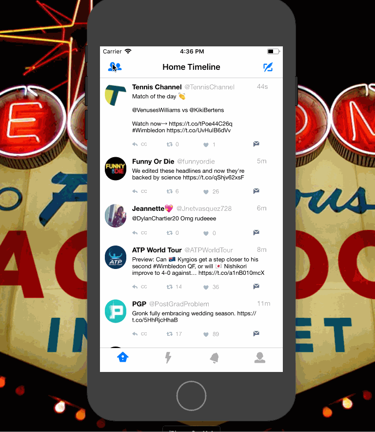

# Twitter

### Starter project
The starter project can be found in the `starter-project` tag. Download and run `pod install`.

### Notes
https://paper.dropbox.com/doc/Twitter--ADuVCVvwop_njSNAbUU96Q2VAQ-g255BPX3K4X7G0reYOWCI

# Project 4 - *Name of App Here*

**Name of your app** is a basic twitter app to read and compose tweets the [Twitter API](https://apps.twitter.com/).

Time spent: **X** hours spent in total

## User Stories

The following **required** functionality is completed:

- [y] User sees app icon in home screen and styled launch screen
- [y] User can sign in using OAuth login flow
- [y] User can Logout
- [y] User can view last 20 tweets from their home timeline
- [y] In the home timeline, user can view tweet with the user profile picture, username, tweet text, and timestamp.
- [y] User can pull to refresh.
- [y] User can tap the retweet and favorite buttons in a tweet cell to retweet and/or favorite a tweet.
- [y] User can compose a new tweet by tapping on a compose button.
- [y] Using AutoLayout, the Tweet cell should adjust it's layout for iPhone 7, Plus and SE device sizes as well as accommodate device rotation.
- [y] The current signed in user will be persisted across restarts

The following **optional** features are implemented:

- [y] Tweet Details Page: User can tap on a tweet to view it, with controls to retweet, favorite, and reply.
- [y] User can view their profile in a *profile tab*
   - Contains the user header view: picture and tagline
   - Contains a section with the users basic stats: # tweets, # following, # followers
   - [n] Profile view should include that user's timeline
- [y] User should display the relative timestamp for each tweet "8m", "7h"
- [y] User should be able to unretweet and unfavorite and should decrement the retweet and favorite count. Refer to [[this guide|unretweeting]] for help on implementing unretweeting.
- [n] Links in tweets are clickable.
- [y] User can tap the profile image in any tweet to see another user's profile
   - Contains the user header view: picture and tagline
   - Contains a section with the users basic stats: # tweets, # following, # followers
- [y] User can load more tweets once they reach the bottom of the feed using infinite loading similar to the actual Twitter client.
- [n] When composing, you should have a countdown for the number of characters remaining for the tweet (out of 140) (**1 point**)
- [y] After creating a new tweet, a user should be able to view it in the timeline immediately without refetching the timeline from the network.
- [n] User can reply to any tweet, and replies should be prefixed with the username and the reply_id should be set when posting the tweet (**2 points**)
- [n] User sees embedded images in tweet if available 
- [y] User can switch between timeline, mentions, or profile view through a tab bar (**3 points**)
- [n] Profile Page: pulling down the profile page should blur and resize the header image. (**4 points**)

The following **additional** features are implemented:

- Custom UI including rounded images and beautfiful no highlighting when tapped tweets.

Please list two areas of the assignment you'd like to **discuss further with your peers** during the next class (examples include better ways to implement something, how to extend your app in certain ways, etc):

1. learn how to be more comfortable with autolayout as I can now add images from the tweets it would just be ugly to add the image now that it exists
2. planning the optionals better from the beginning because some might not be as bad if they were planned ahead for.

## Video Walkthrough

Here's a walkthrough of implemented user stories:

GIF created with [LiceCap](http://www.cockos.com/licecap/).

## Notes

Describe any challenges encountered while building the app.

## Credits

List an 3rd party libraries, icons, graphics, or other assets you used in your app.

- [AFNetworking](https://github.com/AFNetworking/AFNetworking) - networking task library

## License

    Copyright [2018] [Connor Clancy]

    Licensed under the Apache License, Version 2.0 (the "License");
    you may not use this file except in compliance with the License.
    You may obtain a copy of the License at

        http://www.apache.org/licenses/LICENSE-2.0

    Unless required by applicable law or agreed to in writing, software
    distributed under the License is distributed on an "AS IS" BASIS,
    WITHOUT WARRANTIES OR CONDITIONS OF ANY KIND, either express or implied.
    See the License for the specific language governing permissions and
    limitations under the License.
